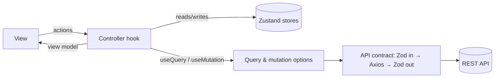

# Books — Fast-Test Homework

A small React app that lists "books" from the Reaktivate TDD API, lets a signed-in user create books, switch between
**All books** / **Private books**, reset their data, and shows the number of private books in a sticky application header.

The goal of the task is a **"flat presentation"**: the UI contains no business logic, and all logic lives in
small controllers that can be tested without rendering anything.

**Stack:** React · TypeScript · Vite · TanStack Query · Zustand · TanStack Form · Zod · Axios · Radix UI Themes ·
i18next · notistack · ts-pattern · Vitest

---

## Getting started

1. Install dependencies

   ```bash
   npm install
   ```

2. Configure the API

   ```bash
   VITE_API_BASE_URL=https://tdd.demo.reaktivate.com/v1
   ```

3. **Trust the self-signed certificate.** The API uses a self-signed SSL certificate. Before the first run open any
   endpoint directly in the browser, e.g. `https://tdd.demo.reaktivate.com/v1/books/<your-nickname>`, and choose
   "proceed / allow". Without this step every request fails with a network error.

4. Run

   ```bash
   npm run start      # start the app
   npm test         # run the tests
   ```

5. Click **Sign in** and enter any nickname. It is used as the `[user]` part of the API path, and it is persisted in
   `localStorage`.

---

## Requirements coverage

| Requirement | Where / how                                                                                                                                                                                                                        |
| --- |------------------------------------------------------------------------------------------------------------------------------------------------------------------------------------------------------------------------------------|
| Zero logic and calculations in TSX | Every component with logic has a controller (`*.controller.ts`, or the form hook). Views only call the controller and render what it returns. Branching on state is done with *state → component maps*, not `if`/ternaries in JSX. |
| MVP / MVVM with controllers | See [Architecture](#architecture). A controller is a custom hook that owns the logic and returns a ready-to-render view model.                                                                                                     |
| MobX or own MVVM | Own implementation on TanStack Query + Zustand + TanStack Form. Motivation in [Key decisions](#key-decisions-and-motivation).                                                                                                      |
| Books creation | `features/add-book`: a modal with a TanStack Form, Zod validation, dynamic custom properties.                                                                                                                                      |
| Tests on logic | See [Testing](#testing).                                                                                                                                                                                                           |
| Part 2a — All / Private switch | `widgets/books-selector`. The two options are mutually exclusive (`aria-pressed` buttons). The mode lives in a Zustand store and is part of the query key.                                                                         |
| Part 2b — sticky header with a private books counter | `widgets/header`. The counter reads the *private* books query, so it does not depend on the selected mode and updates after create/reset.                                                                                          |

Coding-guideline checklist:

- Reusable vs feature-specific code is split by FSD layers (`shared` / `entities` / `features` / `widgets` / `pages`).
- Global state contains only shared data (`UserStorage`, `BookListStorage`). Server data is never copied into a store.
- Views are functional components and only consume controllers/stores.
- Local controllers are hooks, so lifecycle and disposal are handled by React (no manual subscriptions).
- Zustand is always consumed through selectors to avoid unnecessary renders.
- No `console.log` in the code.

---

## Architecture

### Layers (Feature-Sliced Design)

```
src/
├─ app/        providers, API client, QueryClient           (composition root)
├─ pages/      main-page                                    (chooses the screen)
├─ widgets/    header, books-list                            (compose features)
├─ features/   add-book, sign-in, sign-in-notification,
│              books-selector, books-item                   (user scenarios)
├─ entities/   books, user                                  (schemas, contracts, queries, mutations, storage)
└─ shared/     form, api-contract, error-handler, i18n, ui  (reusable, domain-agnostic)
```

Each slice is split into `ui/` (views), `model/` (controllers, stores, state, schemas) and `lib/` (pure helpers).
Imports only go downwards (`pages → widgets → features → entities → shared`).

### Mapping to the reference scheme

```
View ──actions──▶ Controller ──PM──▶ Repository ──DTO──▶ Service
  ◀──VM (observable)──┘
```

| Scheme | In this project                                                                                   |
| --- |---------------------------------------------------------------------------------------------------|
| **View** | `ui/*.tsx` — functional components, JSX only                                                      |
| **Controller** | `model/*.controller.ts` and form hooks (`create-book.form.ts`, `sign-in.form.ts`)                 |
| **VM (observable)** | the object a controller returns (values from Zustand / TanStack Query are reactive)               |
| **PM** (programmer's model) | types inferred from Zod schemas (`Book`, `CreateBook`, …)                                         |
| **Repository** | `entities/*/queries`, `mutations`, `contracts` and the Zustand stores (`*-storage.repository.ts`) |
| **DTO** | request/response Zod schemas in `entities/*/schemas`                                              |
| **Service / gateway** | the Axios instance in `sshared/api/api-client.ts`                                                 |

### Data flow



---

## Key decisions and motivation

**1. A custom MVVM instead of MobX.** The task explicitly allows its own implementation. TanStack Query already solves
the hardest part of the data layer (caching, request state, invalidation) and Zustand covers the small amount of
client-only state. A controller is a hook that combines them and exposes a *view model*. This keeps the same contract
as MobX controllers: the View sends actions and reads reactive values.

**2. Controller = custom hook.** The hook owns the logic, subscribes to the stores, and returns primitives, flags and
callbacks that are ready to render. Lifecycle and cleanup are handled by React and the libraries, which covers the
"care about disposal" guideline without manual `dispose()` code.

**3. Server state and client state are separated.** Books are server state (TanStack Query, single source of truth).
UI state (the selected mode) and the session (user) live in Zustand. Nothing is duplicated between them.

**4. API contracts with Zod on both sides.** `createApiContract({ in, out, action })` validates the input, calls the
service, validates the output and normalizes every failure (Axios, Zod, generic) to one error shape. The rest of the
app never sees raw Axios errors, and a change in the API surfaces as a validation error at the boundary.
Zod schemas are the DTOs; their inferred types are the PM.

**5. State → screen maps instead of conditionals in JSX.** A controller returns an explicit state
(`MainPageScreens`, query `status`), and the view picks a component from a `Record<State, Component>`. There is no
branching in the view, and the decision itself is a pure function of the state, so it is easy to test.

**6. Forms.** TanStack Form is the view model of a form (values, validity, submit state). Validation rules are Zod
schemas, and validation messages go through i18n. The form hook of a feature owns submit logic: mapping the form to a
DTO, calling the mutation, closing the modal. Field components are thin wrappers.

**7. Cache strategy.**
- *Create book:* after a successful request the new book is appended to both cached lists (all / private), so the list
  and the header counter update immediately without an extra request.
- *Reset:* invalidates every active `["books"]` query, so the list and the counter are refetched.
- The user is part of every query key, so data of different users never mixes.

**8. Loading UX.** Placeholder rows (`placeholderData`) render skeletons while a list is loading, and the layout
does not jump. A failed request renders a dedicated error screen.

**9. Error handling.** Mutations use a shared `errorHandler` that maps an error to a message (i18n) and shows it as
a snackbar. Validation messages for forms are resolved by `form id + field path + zod code`.

---

## Testing

The test strategy follows the point of the task: *fast tests on logic, without rendering UI*.

- **Runner:** Vitest. Logic runs in the `jsdom` + `@testing-library/react` environment.
  (`renderHook`).
- **Location:** tests live next to the code they cover, following the slice structure.
    Shared helpers (test `QueryClient`, provider wrapper, API mocks) are in `src/shared/testing/`.
- **What is covered:**
   - pure helpers and schemas (`prepare-book`, `get-short-id`, Zod schemas, `prettify-zod-issue`);
   - the API-contract pipeline (validation, Axios error normalization, `should-log-axios`);
   - stores (`UserStorage`, `BookListStorage`, `useRequiredUserStorage`);
   - controllers (`main-page`, `books-list`, `books-selector`, `reset`, `header-account`, `book-item`);
   - forms (sign-in and create-book submit flow, validation);
   - mutations (cache updates and invalidation);
- **Not covered on purpose:** pure markup of Views (they contain no logic), and visual styling.
- **Coverage**: Test coverage summary presented via `./coverage`. View the full report in `./coverage/index.html`.

Run: `npm test`.

---

## Trade-offs

- **No MobX.** This is a conscious deviation that is allowed by the task. The architectural contract (View → Controller →
  Repository → Service) is preserved.
- **Optimistic cache update on create** relies on the server returning the same data we sent. If the API starts to
  generate fields (ids, timestamps), switch to `invalidateQueries` or use the server response.
- **No pagination or virtualization** for long lists — the API in the task returns plain arrays.
